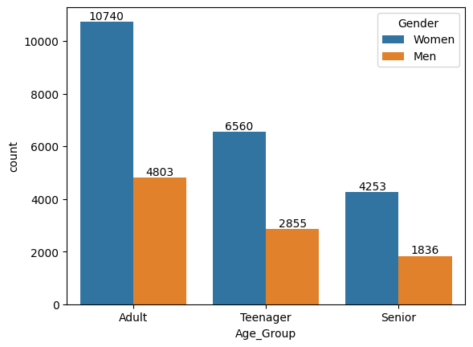

## Overview

This dataset contains information about e-commerce sales transactions, including details such as order ID, customer ID, gender, age, date, product details, and more. The data is in tabular form and can be used for various analysis and machine learning tasks related to e-commerce.

## Columns

1. **index**: Index of the record.
2. **Order ID**: Unique identifier for each order.
3. **Cust ID**: Unique identifier for each customer.
4. **Gender**: Gender of the customer (e.g., Men, Women).
5. **Age**: Age of the customer.
6. **Age Group**: Categorized age group of the customer (e.g., Teenager, Adult, Senior).
7. **Date**: Date of the transaction.
8. **Month**: Month of the transaction.
9. **Status**: Order status (e.g., Delivered, Refunded).
10. **Channel**: Sales channel (e.g., Myntra, Ajio, Amazon).
11. **SKU**: Stock Keeping Unit, a unique identifier for each product.
12. **Category**: Product category (e.g., kurta, Western Dress, Top, Set).
13. **Size**: Size of the product (e.g., XS, S, M, L, XL, XXL, 3XL).
14. **Qty**: Quantity of the product in the order.
15. **Currency**: Currency used for the transaction.
16. **Amount**: Total amount of the transaction.
17. **ship-city**: City where the order is shipped.
18. **ship-state**: State where the order is shipped.
19. **ship-postal-code**: Postal code of the shipping address.
20. **ship-country**: Country where the order is shipped.
21. **B2B**: Indicates if the order is a Business-to-Business transaction (TRUE/FALSE).

## Usage

This dataset can be used for:

- E-commerce sales analysis.
- Customer segmentation based on age and gender.
- Product category analysis.
- Sales channel performance analysis.
- Predictive modeling for order status.

## Contributing

If you would like to contribute or have suggestions for improvement, please open an issue or create a pull request.

## Business Questions
1. IN THE GIVEN DATASET,WHO HAVE ORDERED THE PRODUCTS THE MOST MALE/FEMALE? 
2. WHO HAS THE MOST  PURCHASING POWER  FEMALE OR MALE. 
3. HOW MUCH PROFIT HAS GENERATED FROM ADULT,TEENAGER,SENIOR WOMEN? 
4. HOW MUCH ORDERS HAS GENERATED FROM ADULT,TEENAGER,SENIOR MEN 
5. WHICH IS THE TOP SELLING PRODUCT? 
6. WHICH MEDIA IS GENERATING MOST PROFIT TO THE COMPANY WHERE STATUS IS DELIVERED? 
7. WHICH PRODCT IS HIGHLY PURCHASED BY TEENAGERS BY AMAZON? 
8. WHICH STATE HAS GENERATED HIGHEST AMOUNT OF PROFIT WHERE STATUS IS DELIVERED?
9. WHICH IS THE MOST COMMON MEDIA DOES PEOPLE PREFERED?

## Exploratory Data Analysis
1. Display distinct age_group.
2. Display distinct category 
3. Display customers who have purchased Kurta
4. Display details of  Teenagers  from karnataka.
5. Find category that has been shiped to New Delhi
6. Show total number of columns  in Store table
7. How many orders have a status of 'Pending'?
8. Which media type is the most common for orders?
9. What category has the highest average order amount?
10. What is the total quantity of items ordered across all transactions?
11. Which currency is most commonly used in the dataset?
12. How many orders have a ship country of 'United States'?
13. What is the average age of customers for each category?

## Descriptive Statistics:
1. What is the average order amount in the dataset?
2. Can you provide a summary of the distribution of the 'AGE' variable?
3. What is the most common 'STATUS' in the dataset?
4. How many unique customers are there in the dataset?
5. What is the average age for each age group?
6. What is the distribution of order statuses for each category?
7. Can you identify any patterns in the quantity ordered based on the month?
8. What is the average order amount for each state in the dataset?
9. How does the average order amount vary for different countries?
10. Is there a correlation between the age of customers and the quantity ordered?
 

## View
1. CREATE A VIEW AND DISPLAY WHICH STATE HAS MAXIMUM PUSRCHASE POWER
2. CREATE A VIEW TO DISPLAY WHICH AGE_GROUP HAVE PURCHASED A LOT
3. CREATE VIEW TO IDENTIFY TOTAL NUMBER OF ORDERS RECEIVED
4. CREATE A VIEW FIND AVG AGE OF CUSTOMER
5. CREATE A VIEW TO FIND TOTAL SALES BY MONTH AND STATUS:
6. CREATE A VIEW TO IDENTIFY TOP SELLING PRODUCT IN STORE
7. CREATE A VIEW TO IDENTIFY HIGHEST PROFIT GENERATED FROM WHICH CITY
8. CREATE A VIEW EVALUATE THE PERFORMANCE OF DIFFERENT MEDIA.
9. CREATE A VIEW TO ANALYZE WHICH MONTH GOT HIGHEST SALE/PROFIT
10. CREATE A VIEW TO IDENTIFY WHICH SHIP_CITY IS LEADING IN KURTA
11. CREATE A VIEW TO IDENTIFY WHAT ITEM DOES MEN HAVE PURCHASED THE MOST?
12. CREATE A VIEW FOR HOW MANY WOMEN TEENAGER HAVE PURCHASED  KURTA AND TOTAL REVENURE GENERATED FROM THAT
13. CREATE A VIEW ,AND IDENTIFY HOW MUCH REVENUE GENERATED FROM SETBETWEEN JAN TO MARCH
14. CREATE A VIEW HOW MUCH KURTAS HAS DELIVERED BY AMAZON IN THE MONTH ON MARCH IN MUMBAI 
15. CREATE A VIEW TO IDENTIFY WHICH PRODUCT IS TOP 2 SELLING IN HARYANA?
16. CREATE A VIEW TO IDENTIFY how much revenue generated by state haryana in category of set

##  MATERIALIZED VIEW
1. WHICH STATE HAS MAXIMUM PUSRCHASE POWER?
2. WHICH ITEMS IN MAHARASHTRA ARE TOP SELLING?
